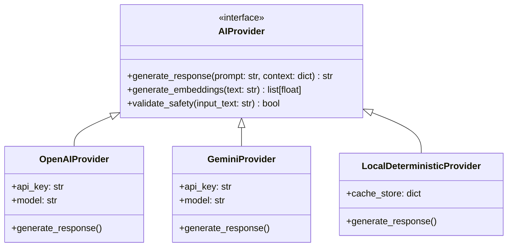

# AROHAN AI: Intelligence Layer Architecture Specification

**Component**: AROHAN AI & Skill Diagnostics  
**Guiding Principle**: *"AI recommends. Faculty guides. Student improves."*  
**Strict Ethical Rule**: AI never hallucinates or fabricates student scores, attendance, certificates, or competencies. If evidence is insufficient, returns `INSUFFICIENT_EVIDENCE`.

---

## 1. Provider Abstraction Architecture

To avoid vendor lock-in, all AI interactions pass through the `AIProvider` abstract interface.

- **Environment Config**:
  - `AI_PROVIDER`: `gemini` | `openai` | `local_deterministic`
  - `AI_MODEL`: e.g. `gemini-1.5-pro` or `gpt-4o-mini`
  - `EMBEDDING_MODEL`: `text-embedding-3-small` or local sentence transformer
  - `AI_API_KEY`: Secure vault token

---

## 2. Bayesian Knowledge Tracing (BKT) Engine

For each student $s$ and atomic skill $k$, AROHAN models latent mastery probability $P(L_t)$ using Bayesian Knowledge Tracing.

### Mathematical Parameters:
- $P(L_0)$: Prior probability of knowing the skill before any interaction (default: $0.10$).
- $P(T)$: Transition probability of acquiring the skill during an opportunity (default: $0.15$).
- $P(G)$: Guess probability: answering correctly despite not knowing the skill (default: $0.20$).
- $P(S)$: Slip probability: answering incorrectly despite knowing the skill (default: $0.10$).

### Posterior Mastery Computation:
1. **Upon Observation ($O_t \in \{\text{Correct}, \text{Incorrect}\}$)**:
   $$P(L_t | O_t = \text{Correct}) = \frac{P(L_{t-1}) \cdot (1 - P(S))}{P(L_{t-1}) \cdot (1 - P(S)) + (1 - P(L_{t-1})) \cdot P(G)}$$
   $$P(L_t | O_t = \text{Incorrect}) = \frac{P(L_{t-1}) \cdot P(S)}{P(L_{t-1}) \cdot P(S) + (1 - P(L_{t-1})) \cdot (1 - P(G))}$$

2. **Skill Transition (Learning Update)**:
   $$P(L_t) = P(L_t | O_t) + (1 - P(L_t | O_t)) \cdot P(T)$$

3. **Mastery Classifications**:
   - $P(L_t) < 0.40$: **Novice / Gap Detected** -> Recommend prerequisite learning.
   - $0.40 \le P(L_t) < 0.70$: **Developing** -> Recommend guided practice.
   - $0.70 \le P(L_t) < 0.85$: **Proficient** -> Mixed practice.
   - $P(L_t) \ge 0.85$: **Mastered** -> Validation assessment / Spaced review.

---

## 3. Skill-Gap Engine Formula

To prioritize which skills need intervention, AROHAN calculates a multi-factor `GapScore`:

$$\text{GapScore} = 0.45 \cdot (1 - P(L_t)) + 0.20 \cdot \text{RecentErrorRate} + 0.15 \cdot W_{\text{assessment}} + 0.10 \cdot W_{\text{coding}} + 0.10 \cdot \text{RecencyFactor}$$

- **Threshold Guard**: If total observations $N < 3$, status is strictly `INSUFFICIENT_EVIDENCE`.
- **Top 3-5 Rules**: Never present more than 5 recommendations to prevent student cognitive overload. Never recommend already mastered skills unless scheduled for spaced revision.

---

## 4. Evidence Drawer & Explainability

Every recommendation provides a direct link to the **"Why am I seeing this?"** drawer:
- Visual breakdown of prior MCAT question attempts on this topic.
- Chronological error history.
- Mathematical explanation of the gap score calculation.
- Syllabus prerequisite alignment (e.g. *Percentages is prerequisite for Profit & Loss and Data Interpretation*).
