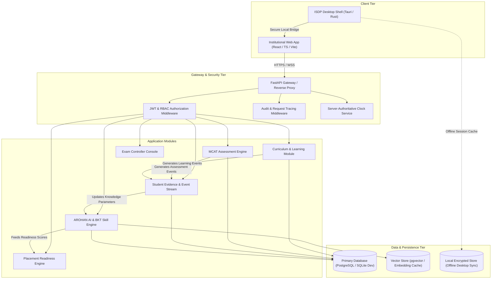

# ISDP + AROHAN AI: System Architecture Specification

**Architecture Version**: 1.0.0  
**Target Topology**: Modular Monolith + Asynchronous Workers + Desktop Client

---

## 1. High-Level System Architecture Diagram



---

## 2. Five-Layer AROHAN AI Research Architecture

```
+-------------------------------------------------------------------------------+
| LAYER 5: Application & Institutional Dashboards                                |
| - Student Learning Command Center  - Faculty Remedial Intervention Desk       |
| - Exam Controller Live Monitor     - Placement Readiness Explorer             |
+-------------------------------------------------------------------------------+
| LAYER 4: Recommendation & Feedback Engine                                     |
| - Explainable Top 3-5 Recommendations ("Why am I seeing this?")                |
| - Spaced Repetition Scheduler (FSRS/SM-2)  - Faculty Intervention Approvals   |
+-------------------------------------------------------------------------------+
| LAYER 3: AI Analysis & Diagnostics                                             |
| - Bayesian Knowledge Tracing (BKT: L0, T, S, G parameters)                    |
| - Multi-Factor Skill Gap Engine (Gap, Error Rate, Recency, Assessment Weight)  |
| - IRT Psychometrics (Facility index p, Item discrimination a, Difficulty b)   |
+-------------------------------------------------------------------------------+
| LAYER 2: Student Competency Modeling                                           |
| - Student x Skill Competency Matrix                                            |
| - Bayesian Posterior Mastery Distribution & Confidence Indices                |
+-------------------------------------------------------------------------------+
| LAYER 1: Immutable Evidence & Data Ingestion                                   |
| - Event Stream: StudentViewedResource, QuestionAnswered, MCATSubmitted        |
| - High-Fidelity Timestamps & Cryptographic Audit Signatures                   |
+-------------------------------------------------------------------------------+
```

---

## 3. Communication & Synchronization Patterns

1. **Stateless API Interactions**: RESTful endpoints authenticated via `Bearer <JWT_ACCESS_TOKEN>` returning standardized JSON structures.
2. **Server-Authoritative Clock**: Every response injects headers:
   - `X-Server-Time-UTC`: ISO-8601 UTC timestamp.
   - `X-Request-ID`: UUID for distributed log correlation.
3. **Resilient Exam Synchronization**: MCAT client buffers question state changes in memory and local encrypted storage. If network degradation occurs, heartbeats attempt reconnection without disrupting the student's timer.
4. **Zero-Trust Role Enforcement**: Database queries enforce tenant boundaries (`institution_id`, `department_id`, and user ownership) at the service layer.
