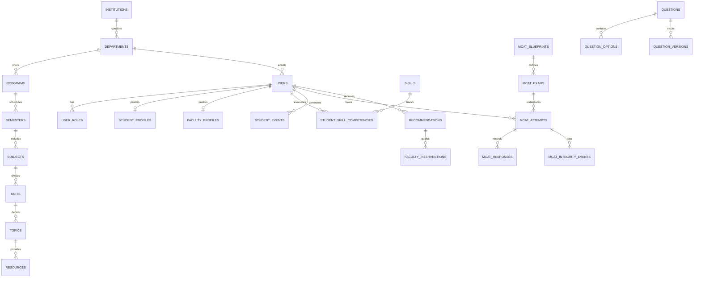

# ISDP + AROHAN AI: Database Architecture & ERD Specification

**Database Target**: PostgreSQL 16+ (Production with `pgvector`) / SQLite 3.50+ (Local Test & Dev)  
**ORM Layer**: SQLAlchemy 2.0 (Async Engine)  

---

## 1. Entity-Relationship Diagram (Mermaid)

---

## 2. Core Tables and Schema Definitions

### 2.1 Institutional Hierarchy
- **`institutions`**: `id` (UUID, PK), `name` (VARCHAR), `code` (VARCHAR, UNIQUE), `created_at` (TIMESTAMP).
- **`departments`**: `id` (UUID, PK), `institution_id` (FK), `name`, `code`, `hod_user_id` (FK).
- **`programs`**: `id` (UUID, PK), `department_id` (FK), `name` (e.g., 'MCA', 'BCA'), `duration_years` (INT).
- **`semesters`**: `id` (UUID, PK), `program_id` (FK), `semester_number` (INT), `academic_year` (VARCHAR).
- **`subjects`**: `id` (UUID, PK), `semester_id` (FK), `name`, `code`, `credits` (INT).
- **`units`**: `id` (UUID, PK), `subject_id` (FK), `unit_number` (INT), `title` (VARCHAR).
- **`topics`**: `id` (UUID, PK), `unit_id` (FK), `title` (VARCHAR), `learning_objective` (TEXT), `sequence_order` (INT).
- **`resources`**: `id` (UUID, PK), `topic_id` (FK), `title`, `resource_type` (PDF, VIDEO, CODE, NOTES), `file_url`, `content_text` (TEXT).

### 2.2 Identity & Access Management
- **`users`**: `id` (UUID, PK), `institution_id` (FK), `email` (VARCHAR, UNIQUE), `password_hash` (VARCHAR), `first_name`, `last_name`, `is_active` (BOOL), `created_at`.
- **`roles`**: `id` (INT, PK), `name` (VARCHAR, UNIQUE: SUPER_ADMIN, INSTITUTE_ADMIN, HOD, FACULTY, EXAM_CONTROLLER, PLACEMENT_OFFICER, MENTOR, STUDENT).
- **`user_roles`**: `user_id` (FK), `role_id` (FK) -> Composite PK (`user_id`, `role_id`).
- **`student_profiles`**: `user_id` (PK, FK), `roll_number` (VARCHAR, UNIQUE), `department_id` (FK), `program_id` (FK), `semester_id` (FK), `current_cgpa` (FLOAT).

### 2.3 Evidence & Bayesian Knowledge Tracing
- **`skills`**: `id` (UUID, PK), `category` (QUANTITATIVE, LOGICAL, VERBAL, DATA_INTERPRETATION, CODING, TECHNICAL), `name` (VARCHAR, UNIQUE), `description`.
- **`student_events`**: `id` (UUID, PK), `student_id` (FK), `timestamp` (TIMESTAMP), `event_type` (VARCHAR), `source` (VARCHAR), `skill_id` (FK, NULLABLE), `metadata_json` (JSONB/TEXT).
- **`bkt_parameters`**: `skill_id` (PK, FK), `p_l0` (FLOAT), `p_t` (FLOAT), `p_s` (FLOAT), `p_g` (FLOAT).
- **`student_skill_competencies`**: `id` (UUID, PK), `student_id` (FK), `skill_id` (FK), `mastery_probability` (FLOAT), `confidence_score` (FLOAT), `evidence_count` (INT), `last_updated` (TIMESTAMP). UNIQUE(`student_id`, `skill_id`).

### 2.4 MCAT Assessment & Psychometrics
- **`questions`**: `id` (UUID, PK), `skill_id` (FK), `category` (VARCHAR), `subcategory` (VARCHAR), `difficulty` (FLOAT), `question_type` (MCQ, CODING), `question_text` (TEXT), `status` (APPROVED, etc.), `created_by` (FK).
- **`question_options`**: `id` (UUID, PK), `question_id` (FK), `option_key` (A, B, C, D), `option_text` (TEXT), `is_correct` (BOOL).
- **`mcat_blueprints`**: `id` (UUID, PK), `title` (VARCHAR), `total_questions` (INT), `time_limit_minutes` (INT), `distribution_json` (JSONB/TEXT).
- **`mcat_exams`**: `id` (UUID, PK), `blueprint_id` (FK), `title` (VARCHAR), `access_code` (VARCHAR), `scheduled_start` (TIMESTAMP), `scheduled_end` (TIMESTAMP), `is_published` (BOOL).
- **`mcat_attempts`**: `id` (UUID, PK), `exam_id` (FK), `student_id` (FK), `status` (VARCHAR: 11-State Enum), `started_at` (TIMESTAMP), `submitted_at` (TIMESTAMP), `score_raw` (FLOAT), `score_percentage` (FLOAT), `ability_estimate_theta` (FLOAT).
- **`mcat_responses`**: `id` (UUID, PK), `attempt_id` (FK), `question_id` (FK), `selected_option_id` (FK, NULLABLE), `is_marked_for_review` (BOOL), `response_time_seconds` (FLOAT), `is_correct` (BOOL).
- **`mcat_integrity_events`**: `id` (UUID, PK), `attempt_id` (FK), `event_type` (FOCUS_LOST, CLIPBOARD_COPY, FULLSCREEN_EXIT, ANOMALY_TIME), `severity` (LOW, MEDIUM, HIGH), `timestamp` (TIMESTAMP), `details_json` (JSONB/TEXT).

### 2.5 AROHAN Recommendations & Interventions
- **`recommendations`**: `id` (UUID, PK), `student_id` (FK), `skill_id` (FK), `title` (VARCHAR), `action_type` (PREREQUISITE_LEARN, GUIDED_PRACTICE, VALIDATION_ASSESSMENT), `evidence_summary` (TEXT), `is_completed` (BOOL), `created_at` (TIMESTAMP).
- **`faculty_interventions`**: `id` (UUID, PK), `faculty_id` (FK), `student_id` (FK), `skill_id` (FK), `intervention_action` (TEXT), `status` (PENDING, ACCEPTED, COMPLETED), `created_at` (TIMESTAMP).

---

## 3. Indexing & Concurrency Strategy

1. **Composite Indexes**:
   - `student_skill_competencies(student_id, skill_id)`
   - `mcat_attempts(student_id, exam_id, status)`
   - `mcat_responses(attempt_id, question_id)`
   - `student_events(student_id, timestamp DESC)`
2. **Immutable Audit Trails**: `student_events` and `mcat_integrity_events` are append-only.
3. **Database Portability**: Standard ANSI SQL data types utilized with abstraction layers in SQLAlchemy for seamless testing against SQLite and production scaling on PostgreSQL.
