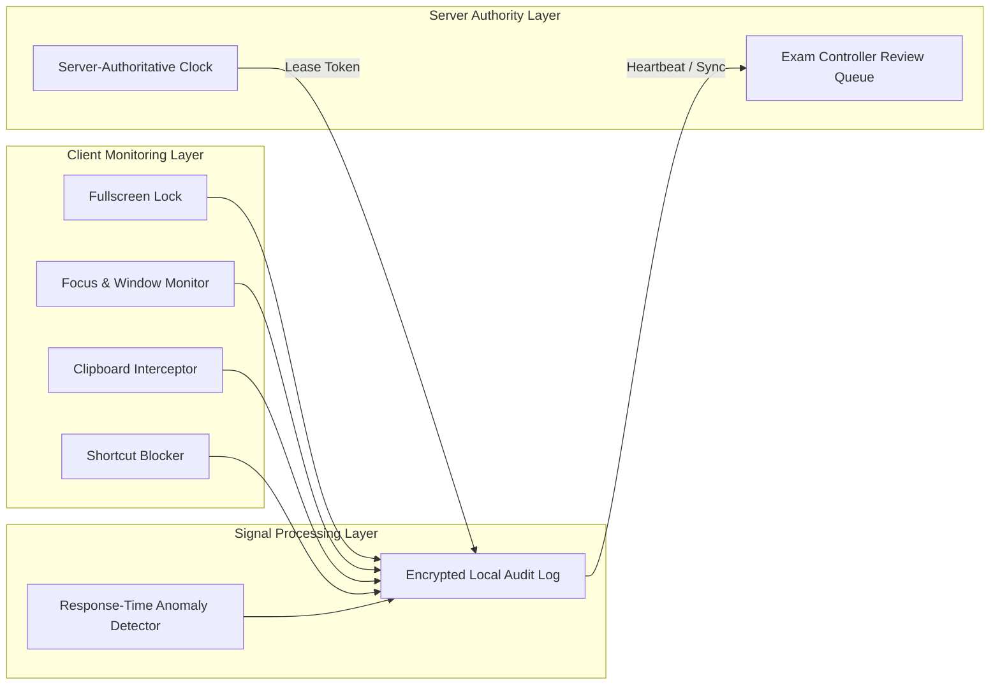

# MCAT & Desktop Exam Security Specification

**System**: Secure Desktop Examination Environment  
**Philosophy**: Layered defense to reduce cheating opportunities and preserve evidence without making dishonest claims of "100% cheat-proof" or automated false accusations.

---

## 1. Operating Principle: Signals, Not Automatic Guilt

1. **No Automated Guilt Determination**: Software monitors and records objective environmental events.
2. **Standard Terminology**:
   - ALLOWED: `Integrity Signal`, `Unusual Pattern`, `Review Recommended`, `Potential Anomaly`.
   - FORBIDDEN: `Cheater Detected`, `Guilt Confirmed`.
3. **Institutional Human-in-the-Loop**: All integrity signals are cataloged with timestamps and sent to the Examination Controller console for formal human review.

---

## 2. Desktop Kiosk Controls (Tauri / Native Shell)

- **Enforced Controls**:
  - Fullscreen kiosk window mode preventing standard desktop navigation.
  - Interception of key shortcuts: `Alt+Tab`, `Win+Key`, `Ctrl+C`, `Ctrl+V`, `F12 / DevTools`.
  - Continuous focus loss detection: Records exact timestamp and duration in seconds.
  - Clipboard clearing: System clipboard is purged upon exam initiation and monitored for unauthorized access attempts.

---

## 3. Response-Time Anomaly Detection

To detect scripted bots or unauthorized external answer feeding, response time per item is tracked:
- Let $T_i$ be the time taken to answer question $i$.
- If a student answers $\ge 10$ complex quantitative questions in $< 2.0$ seconds each:
  - Generates `UNUSUAL_RESPONSE_PATTERN` signal.
  - Severity: `MEDIUM`.
  - Sent to Exam Controller for psychometric response pattern verification.

---

## 4. Server-Authoritative Time & Offline Resilience

1. **Clock Desynchronization Defense**: Local system clock adjustments have no effect on exam duration. The client continuously computes its drift relative to `X-Server-Time-UTC`.
2. **Network Resilience**:
   - If internet connection drops, the exam enters `OFFLINE_ACTIVE` mode.
   - Answers and integrity events are encrypted locally using AES-GCM with an ephemeral session key.
   - When connection is re-established, the signed payload is transmitted and reconciled via idempotency keys.
