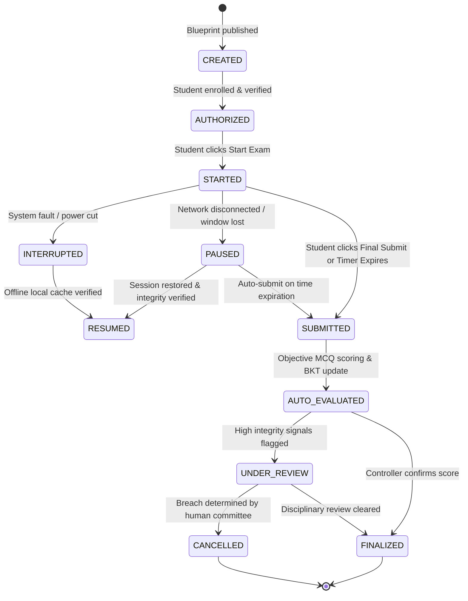

# MCAT: Modular Computerized Aptitude Test Architecture

**System**: MCAT Engine  
**Definition**: Modular Computerized Aptitude Test (Institute Assessment System, NOT the medical school exam).  

---

## 1. Aptitude Taxonomy

1. **QUANTITATIVE**: Percentages, Profit & Loss, Ratio & Proportion, Averages, Time & Work, Time/Speed/Distance, Probability, Permutations & Combinations, Number Systems, Algebra.
2. **LOGICAL REASONING**: Number & Letter Series, Coding/Decoding, Blood Relations, Direction Sense, Syllogisms, Seating Arrangements, Puzzles, Critical Reasoning.
3. **VERBAL ABILITY**: Vocabulary, Grammar, Sentence Correction, Reading Comprehension, Para-Jumbles, Synonyms & Antonyms.
4. **DATA INTERPRETATION**: Tables, Bar & Line Charts, Pie Charts, Caselets.

---

## 2. Strict 11-State Examination Lifecycle State Machine

### Valid Transition Matrix:
- `CREATED -> AUTHORIZED`
- `AUTHORIZED -> STARTED`
- `STARTED -> PAUSED`, `STARTED -> INTERRUPTED`, `STARTED -> SUBMITTED`
- `PAUSED -> RESUMED`, `PAUSED -> SUBMITTED`
- `INTERRUPTED -> RESUMED`, `INTERRUPTED -> SUBMITTED`
- `RESUMED -> STARTED`
- `SUBMITTED -> AUTO_EVALUATED`
- `AUTO_EVALUATED -> UNDER_REVIEW`, `AUTO_EVALUATED -> FINALIZED`
- `UNDER_REVIEW -> FINALIZED`, `UNDER_REVIEW -> CANCELLED`

---

## 3. Question Versioning & Psychometrics

1. **Immutable Historical Records**: If an approved question requires edits, a new `question_version` is generated. Historical student exam attempts point permanently to the immutable question version taken at that time.
2. **Item Facility Index ($p$)**:
   $$p = \frac{\text{Count of Correct Responses}}{\text{Total Responses}}$$
3. **Item Discrimination ($r_{\text{pbi}}$ - Point-Biserial Correlation)**:
   $$r_{\text{pbi}} = \frac{\bar{X}_1 - \bar{X}}{\sigma_X} \sqrt{p(1 - p)}$$
   Questions with $r_{\text{pbi}} < 0.20$ are automatically flagged as `REVIEW_REQUIRED`.
4. **Item Response Theory (2PL)**:
   $$P(\text{Correct} | \theta) = \frac{1}{1 + e^{-a(\theta - b)}}$$
   where $\theta = \text{Candidate Ability}$, $a = \text{Item Discrimination}$, $b = \text{Item Difficulty}$.
