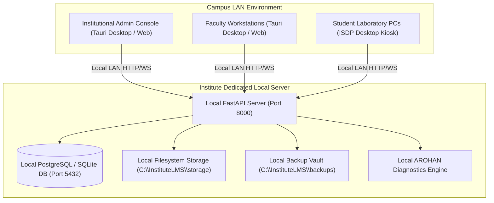

# Local Database Architecture & Offline LAN Topology

**System**: Institute Student Development Platform (ISDP)  
**Deployment Mode**: Offline Local Institutional LAN (Zero Internet/Cloud Dependency)  
**Database Engines**: Local PostgreSQL 16+ / Local High-Concurrency SQLite 3.50+ with WAL mode  

---

## 1. Network Topology (Institute Controlled)

---

## 2. Core Architectural Tenets

1. **No External SaaS / Cloud Database**: Strictly prohibits Supabase, Firebase, AWS RDS, Neon, or PlanetScale. All student and institutional data resides exclusively on institute premises.
2. **Zero Internet Requirement**: Authentication, exam conduct, assignments, file uploads, progress calculation, and backups function 100% offline.
3. **Authorized Email Allowlist**: Only pre-authorized email addresses placed in `authorized_users` by an administrator can register or activate accounts via local activation codes.
4. **Relational Integrity**: Enforces strict foreign keys, unique email/roll/employee constraints, check constraints, composite indexes, and immutable audit streams.
