# Database Schema & Entity Relationship (ER) Specification

This document details the normalized relational database design for the **Institute Student Development Platform (ISDP)** local database running entirely under institutional LAN control.

## 1. Complete Mermaid ER Diagram

```mermaid
erDiagram
    INSTITUTIONS ||--o{ DEPARTMENTS : contains
    INSTITUTIONS ||--o{ USERS : owns
    DEPARTMENTS ||--o{ PROGRAMS : offers
    DEPARTMENTS ||--o{ USERS : assigns
    PROGRAMS ||--o{ SEMESTERS : schedules
    SEMESTERS ||--o{ DIVISIONS : divides
    SEMESTERS ||--o{ SUBJECTS : includes
    ACADEMIC_YEARS ||--o{ DIVISIONS : spans
    ACADEMIC_YEARS ||--o{ STUDENT_ENROLLMENTS : enforces
    ACADEMIC_YEARS ||--o{ FACULTY_SUBJECT_ASSIGNMENTS : assigns

    USERS ||--o{ USER_ROLES : has
    ROLES ||--o{ USER_ROLES : grants
    ROLES ||--o{ ROLE_PERMISSIONS : associates
    PERMISSIONS ||--o{ ROLE_PERMISSIONS : defines

    USERS ||--o| STUDENT_PROFILES : defines
    USERS ||--o| FACULTY_PROFILES : defines
    USERS ||--o{ USER_SESSIONS : maintains
    USERS ||--o{ LOGIN_EVENTS : records
    USERS ||--o{ NOTIFICATIONS : receives
    USERS ||--o{ AUDIT_LOGS : triggers

    AUTHORIZED_USERS ||--o| USERS : activates

    USERS ||--o{ FACULTY_SUBJECT_ASSIGNMENTS : assigned_to
    SUBJECTS ||--o{ FACULTY_SUBJECT_ASSIGNMENTS : assigned_in
    USERS ||--o{ STUDENT_ENROLLMENTS : enrolled_as
    DIVISIONS ||--o{ STUDENT_ENROLLMENTS : enrolled_in

    SUBJECTS ||--o{ UNITS : structures
    UNITS ||--o{ TOPICS : details
    TOPICS ||--o{ RESOURCES : provides

    SUBJECTS ||--o{ ASSIGNMENTS : contains
    USERS ||--o{ ASSIGNMENTS : created_by
    FILES ||--o| ASSIGNMENTS : attaches
    FILES ||--o{ FILE_VERSIONS : tracks

    ASSIGNMENTS ||--o{ ASSIGNMENT_SUBMISSIONS : receives
    USERS ||--o{ ASSIGNMENT_SUBMISSIONS : submitted_by
    ASSIGNMENT_SUBMISSIONS ||--o{ SUBMISSION_FILES : uploads
    FILES ||--o| SUBMISSION_FILES : stores
    ASSIGNMENT_SUBMISSIONS ||--o| ASSIGNMENT_EVALUATIONS : evaluated_by

    USERS ||--o{ RESULTS : awarded_to
    SUBJECTS ||--o{ RESULTS : scored_in
    ASSIGNMENTS ||--o{ RESULTS : generated_from

    SKILLS ||--o{ SKILL_EVIDENCE : collects
    USERS ||--o{ SKILL_EVIDENCE : demonstrates
    USERS ||--o{ STUDENT_PROGRESS : measures
    SUBJECTS ||--o{ STUDENT_PROGRESS : tracks_for

    MCAT_EXAMS ||--o{ MCAT_ITEMS : contains
    MCAT_EXAMS ||--o{ MCAT_ATTEMPTS : conducts
    USERS ||--o{ MCAT_ATTEMPTS : sits_for
    MCAT_ATTEMPTS ||--o{ MCAT_RESPONSES : answers

    USERS ||--o{ RECOMMENDATIONS : suggested_to
    SKILLS ||--o{ RECOMMENDATIONS : targets
```

---

## 2. Table Directory (51 Core Entities)

1. `institutions` - Local institute metadata, regulatory code, accreditation details.
2. `departments` - Academic departments (e.g., Computer Applications, Management).
3. `programs` - Degrees offered (BCA, MCA, BBA) with duration.
4. `academic_years` - Multi-year calendar boundaries (e.g. 2025-2026).
5. `semesters` - Term periods within a program (Semester 1 to 6).
6. `divisions` - Classroom cohorts (Division A, B).
7. `subjects` - Curricular courses (Data Structures, Aptitude, Java).
8. `units` - Modular syllabus units.
9. `topics` - Granular lecture topics.
10. `resources` - Offline reading material, notes, code snippets.
11. `authorized_users` - **Strict administrative allowlist** for zero-trust local account activation.
12. `users` - Base user accounts with Argon2id/bcrypt hashes, lockout controls.
13. `roles` - RBAC hierarchy (SUPER_ADMIN, INSTITUTE_ADMIN, HOD, FACULTY, STUDENT, etc.).
14. `permissions` - Atomic security capabilities (USER_CREATE, ASSIGNMENT_GRADE, etc.).
15. `role_permissions` - Many-to-many permission grants to roles.
16. `user_roles` - Role assignments to individual user accounts.
17. `student_profiles` - Extended demographic, roll number, admission records.
18. `faculty_profiles` - Designation, specialization, employee IDs.
19. `student_enrollments` - Scoped student cohort membership.
20. `faculty_subject_assignments` - Subject-division access boundaries for teachers.
21. `files` - Physical local storage file metadata (SHA-256, path, mime type).
22. `file_versions` - Immutable version lineage of replaced files.
23. `document_permissions` - Role and user-specific document access rules.
24. `assignments` - Tasks, homework, lab assignments with deadlines and marks.
25. `assignment_submissions` - Student submission records, draft/submitted states.
26. `submission_files` - Student uploaded proof/solution files.
27. `rubrics` - Multi-criteria scoring rubrics.
28. `rubric_criteria` - Individual rubric criterion weights and score points.
29. `assignment_evaluations` - Faculty grading remarks, strengths, improvements.
30. `results` - Official academic marks, GPA, and pass/fail states.
31. `progress_weight_configs` - Institutional customizable weights summing to 100%.
32. `student_progress` - Aggregate student performance index.
33. `learning_activities` - Telemetry logs of notes read, assessments taken.
34. `skills` - Ontological knowledge graph of institutional competencies.
35. `skill_categories` - Grouping for cognitive, programming, quantitative skills.
36. `student_skills` - Bayesian Knowledge Tracing (BKT) mastery probability $P(L_t)$.
37. `skill_evidence` - Longitudinal multi-source evidence logs.
38. `bkt_parameters` - Calibration parameters ($P(L_0), P(T), P(G), P(S)$).
39. `mcat_exams` - Computerized Adaptive Test exam instances.
40. `mcat_blueprints` - Examination structure, difficulty targets, and domain distributions.
41. `mcat_items` - Psychometrically calibrated item bank ($a, b, c$).
42. `mcat_attempts` - Student exam sessions and timestamps.
43. `mcat_responses` - Item-level answers, response latency, and scores.
44. `mcat_ability_estimates` - Maximum Likelihood / EAP latent ability estimates $\theta$.
45. `mcat_integrity_events` - Local kiosk security violations (focus loss, window blur).
46. `recommendations` - AROHAN AI diagnostic interventions.
47. `notifications` - Local in-app alerts and reminders.
48. `audit_logs` - Append-only tamper-evident institutional activity records.
49. `login_events` - Authentication attempts, IP address, success/failure reasons.
50. `user_sessions` - Active refresh token hash records with revocation status.
51. `devices` - Registered desktop clients in institutional computer labs.
